# 🇰🇷 Quiz Telegram Bot (Korean Vocabulary)

한국어 학습자를 위한 Telegram 퀴즈 봇입니다.

사용자는 한국어 단어 퀴즈를 통해 어휘력을 향상시킬 수 있으며, 레벨별 문제를 풀고 다른 사용자와 배틀 모드를 진행할 수 있습니다.

---

# Hero

### Problem

외국인 학습자들은 한국어 단어를 꾸준히 암기하기 어렵고, 반복 학습 과정이 지루하다는 문제가 있습니다.

### Solution

Telegram 기반 퀴즈 봇을 통해 별도의 앱 설치 없이 한국어 단어를 학습할 수 있도록 구현했습니다.

### Project Status Badges

[](https://railway.app)
[](#)
[](#)
[](#)

### Tech Stack

* Python
* Aiogram
* SQLite
* Telegram Bot API
* Railway
* GitHub

### Highlights

* 한국어 단어 퀴즈
* 레벨 시스템 (초급 / 중급 / 고급)
* 실시간 배틀 모드
* 자동 상대 매칭
* Telegram 기반 서비스
* Railway 배포

---

# Demo

### Start

```bash
/start
```

### Quiz Flow

1. 사용자가 퀴즈 시작
2. 단어 문제 출제
3. 정답 선택
4. 점수 및 결과 확인
5. 다음 문제 진행

### Battle Flow

1. 사용자 A가 배틀 생성
2. 사용자 B 참가
3. 제한 시간 내 문제 풀이
4. 점수 비교
5. 승자 결정

---

# Features

## Vocabulary Quiz

* 한국어 단어 학습
* 객관식 문제 제공
* 즉시 정답 확인

## Level System

* 초급
* 중급
* 고급

사용자 수준에 맞는 문제 제공

## Battle Mode

* 다른 사용자와 1:1 대결
* 실시간 점수 경쟁
* 자동 매칭 지원

## Statistics

* 사용자 기록 저장
* 점수 관리
* 학습 진행도 확인

## Telegram Native UX

* 별도 설치 불필요
* Telegram 환경에서 바로 사용 가능

---

# Architecture

```text
User
  │
  ▼
Telegram Client
  │
  ▼
Telegram Bot API
  │
  ▼
Aiogram Bot
  │
  ├── Quiz Handler
  ├── Battle Handler
  ├── Matchmaking Service
  └── User Service
  │
  ▼
SQLite Database
```

## Architecture Diagrams



### Components

#### Bot Layer

* 사용자 요청 처리
* 명령어 처리
* 메시지 응답

#### Quiz Service

* 문제 생성
* 정답 판별
* 점수 계산

#### Battle Service

* 배틀 생성
* 참가자 매칭
* 승패 계산

#### Database

* 사용자 정보 저장
* 점수 저장
* 퀴즈 데이터 저장

---

# Runbook

## Local Run

```bash
git clone https://github.com/minhauser/quiz_on_korea_bot.git

cd quiz_on_korea_bot

python -m venv venv

source venv/bin/activate
# Windows
venv\Scripts\activate

pip install -r requirements.txt
```

### Environment Variables

```env
BOT_TOKEN=your_telegram_bot_token
DB_PATH=./data/quiz_bot.db
```

### Start

```bash
python bot.py
```

---

## Railway Deployment

### Variables

```env
BOT_TOKEN=your_token
DB_PATH=/data/quiz_bot.db
```

### Volume

```text
/data
```

### Start Command

```bash
python bot.py
```

---

# Troubleshooting

## Bot does not respond

### Cause

* BOT_TOKEN 설정 오류
* BotFather 토큰 만료

### Solution

* BOT_TOKEN 확인
* Railway Variables 확인

---

## Database Error

### Cause

* DB_PATH 설정 오류
* Volume 미설정

### Solution

* DB_PATH 확인
* Railway Volume 연결 확인

---

## Battle Matching Not Working

### Cause

* 상대방 미참여
* 네트워크 지연

### Solution

* 일정 시간 후 자동 매칭 확인
* 로그 확인

---

# Future Improvements

* 랭킹 시스템
* 일일 학습 목표
* 학습 통계 대시보드
* 관리자 페이지
* AI 기반 문제 생성

---

# Tradeoff Decisions

## Situation

- Telegram 기반 퀴즈 봇을 Python과 Aiogram으로 빠르게 구현해야 했습니다.
- 배포 환경은 Railway로 제한되어 있으며, 지속성 있는 저장소가 필요했습니다.
- 프로젝트에는 별도의 프론트엔드가 없고, 주로 백엔드 로직과 봇 흐름이 핵심입니다.

## Alternatives

- SQLite + Railway Volume
- PostgreSQL/MySQL 또는 외부 DB 서비스
- Aiogram 프레임워크 vs raw Telegram Bot API / 다른 Python 텔레그램 라이브러리
- 로컬 `.env` + `.gitignore` vs 코드 내 환경값 하드코딩
- GitHub 백업 자동화 vs 파일 시스템 백업 또는 백업 미구현

## Selection Criteria

- 빠른 개발과 배포
- 낮은 운영 비용 / 간단한 인프라
- 데이터 지속성 및 봇 세션 안정성
- 보안: 토큰과 민감 정보 분리
- 유지보수성과 확장성

## Experience

- SQLite는 단순한 데이터 모델과 적은 트래픽에는 충분했습니다.
- Railway Volume을 통해 로컬 SQLite 파일을 유지하면서도 배포 환경에서 데이터가 유지되는 구조를 확보했습니다.
- Aiogram의 async 핸들러는 Telegram 콜백 흐름과 배틀 로직을 깔끔하게 관리하는 데 도움이 되었습니다.
- 환경 변수 방식으로 `BOT_TOKEN`과 `GITHUB_TOKEN`을 분리한 것은 보안과 배포 일관성 측면에서 유리했습니다.

## Result

- 선택된 구조: Python + Aiogram + SQLite + Railway Volume
- 장점: 간단한 배포, 빠른 개발, 낮은 운영 부담
- 단점: 고부하나 다중 인스턴스 환경에서는 SQLite 확장성이 제한적
- 이후 개선 방향: 트래픽 증가 시 관리형 관계형 DB로 마이그레이션, 테스트 커버리지 및 모니터링 추가

## Technology Trade-off Table

| Technology | Situation | Alternatives | Selection Criteria | Decision | Result | Challenges |
|---|---|---|---|---|---|---|
| Python | 빠른 백엔드 개발이 필요함 | Node.js, Go, Java | 빠른 생산성, 풍부한 라이브러리, Async 지원 | Python 선택 | 빠르게 프로토타이핑 가능 | GIL로 고부하 동시성은 추가 설계 필요 |
| Aiogram | Telegram Bot API를 효율적으로 사용해야 함 | raw Telegram API, python-telegram-bot | Telegram 특화 라우팅, async 콜백 처리 | Aiogram 선택 | 퀴즈/배틀 플로우 구현이 쉬워짐 | 라이브러리 버전 의존성 관리 필요 |
| SQLite | 간단한 배포 환경에서 DB 지속성이 필요함 | PostgreSQL, MySQL, 외부 DB 서비스 | 설치/운영 간편성, 비용, 데이터 지속성 | SQLite 선택 | Railway 볼륨과 함께 간단하게 운영 가능 | 다중 인스턴스 확장성 제한 |
| Railway | 빠르게 배포하고 환경변수를 관리해야 함 | VPS, Docker, AWS/GCP | 배포 편의성, 자동화, 비용 | Railway 선택 | 배포가 쉬워짐 | 인프라 제어는 제한적 |
| GitHub 백업 | DB 백업과 이력 관리를 자동화해야 함 | S3, DB 스냅샷, 외부 백업 | 백업 자동화, 접근성, 권한 관리 | GitHub 백업 선택 | GitHub 이력으로 백업 가능 | 토큰 관리 필요 |
| .env | 민감 정보를 코드에서 분리해야 함 | 하드코딩, config 파일 커밋 | 보안, 배포 환경 분리 | .env 사용 | 민감 정보 분리로 보안 강화 | 운영 시 환경 변수 관리 필요 |

---

# 직무별 README 강조점

이 프로젝트는 Python과 Aiogram으로 구현된 Telegram Quiz Bot으로, 전체 구조는 백엔드 중심 README 형식으로 정리하는 것이 가장 적합합니다.

## Backend (API·DB·인증/인가)

### 시스템 아키텍처 및 ERD

- Telegram 메시지와 Callback 요청이 `aiogram` 핸들러로 들어와 처리되는 흐름을 중심으로 설명합니다.
- 주요 데이터 모델: `users`, `user_stats`, `battles`, `battle_invites`, `battle_messages`, `quiz_sessions`.
- ERD 이미지를 첨부하거나, 테이블 간 관계도와 외래키 연결을 도식화하여 저장 구조를 명확히 표현합니다.

### Bot Command API 및 매칭 시스템

- 핵심 명령어/핸들러 정리:
  - `/start` — 봇 초기화 및 메인 메뉴 표시
  - `/quiz` 또는 퀴즈 메뉴 진입 — 난이도 선택 및 문제 출제
  - `/battle` — 배틀 초대, 수락, 랜덤 매칭 처리
  - `/ranking`, `/stats` — 사용자 점수 및 순위 조회
- 배틀 매칭 로직:
  - 초대 생성 → 특정 초대 토큰 기반 참가자 매칭
  - 10초 대기 후 랜덤 AI/봇 대체 매칭
  - 배틀 상태 전이(대기→진행→종료)와 DB 저장 방식

### DB 설계 및 사용자 데이터 저장 방식

- 사용자별 진행 상태와 레벨, 정답 스트릭(`LEVEL_UP_CORRECT_STREAK`, `LEVEL_DOWN_WRONG_STREAK`)을 DB에 저장합니다.
- 퀴즈 진행 기록 및 배틀 기록을 별도로 분리하여 통계와 재개 로직을 지원합니다.
- SQLite 파일(`quiz_bot.db`)은 Railway 볼륨으로 유지하며, 로컬 및 배포 환경에서 `DB_PATH`로 분리합니다.

### 배포 구조 및 운영

- Railway 배포 구성:
  - `BOT_TOKEN`, `DB_PATH`, `GITHUB_TOKEN`, `GITHUB_REPOSITORY` 환경 변수 사용
  - `/data` 볼륨 마운트로 SQLite 지속성 확보
- 선택적 DB 백업:
  - `GITHUB_TOKEN`과 `GITHUB_REPOSITORY`가 설정된 경우 주기적 GitHub 업로드로 백업
  - 환경 변수 비노출 정책으로 민감값은 코드에서 분리

### 보안 및 운영 안정성

- 민감 정보는 `.env` 또는 배포 환경 변수에만 저장하고 코드/레포에는 절대 커밋하지 않습니다.
- Telegram Bot Token과 GitHub Token의 노출 방지, `.gitignore`에 `.env`와 `quiz_bot.db`를 포함합니다.
- 입력값 검증과 예외 처리로 잘못된 Callback 데이터 또는 DB 오류가 발생해도 서비스가 중단되지 않도록 설계합니다.

## GitHub Issue / PR 관리 및 Troubleshooting

- 커밋 메시지는 Conventional Commits 방식(`feat`, `fix`, `docs`, `chore`, `refactor` 등)으로 관리합니다.
- 주요 변경 사항과 배포 이력은 `README`와 `DEPLOY.md`에 기록하여 협업 시 참고할 수 있게 합니다.
- 장애 대응 항목:
  - `BOT_TOKEN` 오류
  - `DB_PATH` 또는 볼륨 미설정
  - 매칭/배틀 로직 예외
  - 로깅과 에러 메시지 확인 절차

# Author

순나툴러 (Sunnatulla Mamurov)

Soonchunhyang University
Department of Internet of Things

Python · Aiogram · Telegram Bot Development
